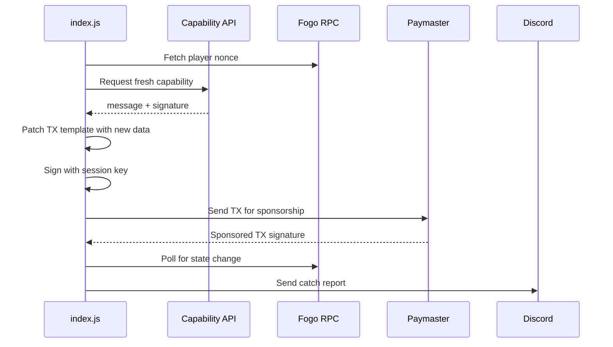

# Fishing Bot

Headless Node.js bot for automated fishing in [Fogo Fishing](https://app.fogofishing.com) game on Fogo chain.

## ✅ Features
- 🎣 Auto-cast fishing line
- 📊 Fish tracking per cast  
- 💬 Discord webhook notifications
- 🖥️ No WebGL required

## How It Works



## Quick Start

```bash
# 1. Install dependencies
npm install

# 2. Run the bot
node index.js
```

## Configuration (index.js)

| Variable | Description |
|----------|-------------|
| `SESSION_KEY_B58` | Session key from browser (base58) |
| `OWNER` | Wallet public key |
| `DISCORD_WEBHOOK_URL` | Discord webhook for notifications |
| `CAST_INTERVAL_MS` | Delay between casts (default: 3000ms) |
| `MAX_CASTS` | Max casts (0 = unlimited) |
| `TX_TEMPLATE_B64` | Browser TX template |

### How to Get Session Key

1. Open [Fogo Fishing](https://app.fogofishing.com) and login with wallet
2. Open browser DevTools (F12) → Console tab
3. Paste and run this script:

```javascript
(async () => {
  const request = indexedDB.open("sessionsdb");
  request.onsuccess = async (e) => {
    const db = e.target.result;
    const tx = db.transaction("sessions", "readonly");
    tx.objectStore("sessions").getAll().onsuccess = async (ev) => {
      const item = ev.target.result[0];
      
      const privPkcs8 = await crypto.subtle.exportKey("pkcs8", item.sessionKey.privateKey);
      const pubRaw = await crypto.subtle.exportKey("raw", item.sessionKey.publicKey);
      
      const privBytes = new Uint8Array(privPkcs8).slice(16, 48);
      const pubBytes = new Uint8Array(pubRaw);
      
      const full = new Uint8Array(64);
      full.set(privBytes, 0);
      full.set(pubBytes, 32);
      
      const A = '123456789ABCDEFGHJKLMNPQRSTUVWXYZabcdefghijkmnopqrstuvwxyz';
      let n = BigInt('0x' + [...full].map(b => b.toString(16).padStart(2,'0')).join(''));
      let r = '';
      while (n > 0) { r = A[Number(n % 58n)] + r; n /= 58n; }
      
      console.log("🔑 SESSION PRIVATE KEY:");
      console.log(r);
      
      let pn = BigInt('0x' + [...pubBytes].map(b => b.toString(16).padStart(2,'0')).join(''));
      let pr = '';
      while (pn > 0) { pr = A[Number(pn % 58n)] + pr; pn /= 58n; }
      console.log("Public key:", pr);
    };
  };
})();
```

4. Copy the **SESSION PRIVATE KEY** output
5. Paste into `SESSION_KEY_B58` in index.js

**Alternative: Capture New Session Key**

If the above script fails with "key is not extractable", run this BEFORE logging in:

```javascript
(function() {
    const originalGenerateKey = crypto.subtle.generateKey;
    crypto.subtle.generateKey = async function(algorithm, extractable, keyUsages) {
        console.log("🔑 FOGO INTERCEPTOR: Forcing extractable: true");
        return originalGenerateKey.call(crypto.subtle, algorithm, true, keyUsages);
    };
    console.log("✅ Interceptor active. Please login or re-establish session now.");
})();
```

run this to capture the session key and then Click Login:

```javascript
const originalGenerateKey = crypto.subtle.generateKey;
crypto.subtle.generateKey = async function(...args) {
    if (args[1] && args[1].name === 'Ed25519') {
        args[2] = true;
    }
    const result = await originalGenerateKey.apply(this, args);
    
    if (result.privateKey && result.publicKey) {
        try {
            const privRaw = await crypto.subtle.exportKey('pkcs8', result.privateKey);
            const pubRaw = await crypto.subtle.exportKey('raw', result.publicKey);
            console.log('🔑 SESSION KEY CAPTURED!');
            console.log('Private (pkcs8):', btoa(String.fromCharCode(...new Uint8Array(privRaw))));
            console.log('Public (raw):', btoa(String.fromCharCode(...new Uint8Array(pubRaw))));
        } catch(e) {}
    }
    return result;
}

console.log('✅ Session key capture ready. Now sign a new session.');
```

then use `convert-session.js` to convert the captured keys to base58 format.

### How to Get TX_TEMPLATE_B64

1. Open [Fogo Fishing](https://app.fogofishing.com) and login with wallet
2. Open browser DevTools (F12) → Network tab
3. Click "Cast" button in the game once
4. Find the request to `sponsor_and_send` in Network tab
5. Click on it → Payload tab → copy the `transaction` value
6. Paste into `TX_TEMPLATE_B64` in index.js

**Or use console script:**

```javascript
const originalFetch = window.fetch;
window.fetch = async (...args) => {
  const res = await originalFetch(...args);
  if (args[0]?.includes?.('sponsor_and_send')) {
    const body = JSON.parse(args[1]?.body || '{}');
    if (body.transaction) {
      console.log("🔑 TX_TEMPLATE_B64:");
      console.log(body.transaction);
    }
  }
  return res;
};
console.log("✅ Interceptor ready. Click Cast now!");
```

## Running

```bash
# Single terminal
node index.js

# Background (pm2)
pm2 start index.js --name fogo-bot

# VPS with screen
screen -S fogo
node index.js
# Ctrl+A, D to detach
```

## Support
[Discord](https://discord.gg/aethereal)

[X](https://x.com/aethereal_co)

[Aomine](https://x.com/aominehg)
